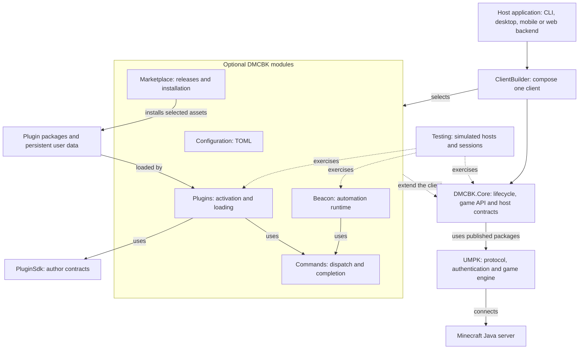

# DMCBK

[](https://www.nuget.org/packages/DMCBK) [](https://www.nuget.org/packages/DMCBK) [](https://github.com/MCCTeam/DMCBK/actions/workflows/build.yml) [](https://dotnet.microsoft.com/download/dotnet/10.0) [](https://learn.microsoft.com/dotnet/csharp/) [](LICENSE.md)

DMCBK, the Dotnet Minecraft Client Building Kit, helps you build Minecraft Java clients in .NET. It adds application hosting, commands, Beacon scripts and plugins to [UMPK](https://github.com/MCCTeam/UMPK), which handles the protocol and game engine.

Use the same client services in a background worker, desktop app or web backend. Your application owns its interface, storage paths and login prompts. Optional modules let you choose the parts you need.

> [!WARNING]
> DMCBK is still in heavy development. APIs, behavior, and documentation are subject to change. Pin the version or commit that your application uses.

## Features

- **Client hosting:** authentication, connection lifecycle, reconnects and independent clients in one process.
- **Game API:** typed access to chat, player state, inventory, entities, terrain and movement through UMPK.
- **Commands:** dispatch, completion and scoped registration for hosts and plugins.
- **Beacon scripting (`.bcn`):** event handlers, scheduled tasks, persistent state, linting, formatting and plugin extensions.
- **Plugins:** C# source or compiled packages, lifecycle hooks, settings, storage, localization and shared contracts.
- **Marketplace:** versioned releases, dependency resolution, platform-specific assets, pins and transactional installation with rollback.
- **Configuration:** typed options and optional TOML loading, validation and persistence.
- **Testing:** simulated script hosts and in-memory plugin sessions, with headless and web-backend samples.

## Architecture



The diagram shows composition and runtime flow. Core defines module boundaries without referencing their implementations. Your host supplies presentation, paths and login prompts. Add Commands before Beacon or Plugins. The [package guide](docs/reference/packages.md) lists package dependencies.

## Start here

1. Install the [.NET 10 SDK](https://dotnet.microsoft.com/download/dotnet/10.0).
2. Read [Your first client](docs/getting-started/first-client.md).
3. Select modules from the [package guide](docs/reference/packages.md).

```bash
dotnet add package DMCBK --version 0.1.0-preview.1
```

The preview uses UMPK `0.9.0-beta.4`. NuGet installation requires the DMCBK packages to be published. Until then, use the [local package procedure](docs/getting-started/installation.md#use-local-packages).

## Documentation

- [Documentation home](docs/index.md)
- [Host a client](docs/hosting.md), including desktop, mobile and web guidance
- [Commands and Beacon](docs/guides/commands-and-beacon.md)
- [Write and test a plugin](docs/guides/plugins.md)
- [Marketplace versions and platform assets](docs/marketplace-v2.md)
- [Configuration](docs/reference/configuration.md) and [limitations](docs/reference/limitations.md)
- [Build and contribute](CONTRIBUTING.md)
- [Publish to NuGet](docs/releases.md)

## Roadmap

- Improve documentation - WIP
- Crowdin integration for translations
- Documentation website
- Extend the Game API with useful functionality
- Benchmark and optimize the whole library and Beacon scripts

## Contributors

[milutinke](https://github.com/milutinke) contributes to UMPK and DMCBK. DMCBK also includes work from the [Minecraft Console Client contributors](https://github.com/MCCTeam/Minecraft-Console-Client/graphs/contributors).

## License

DMCBK uses the [MIT License](LICENSE.md).
